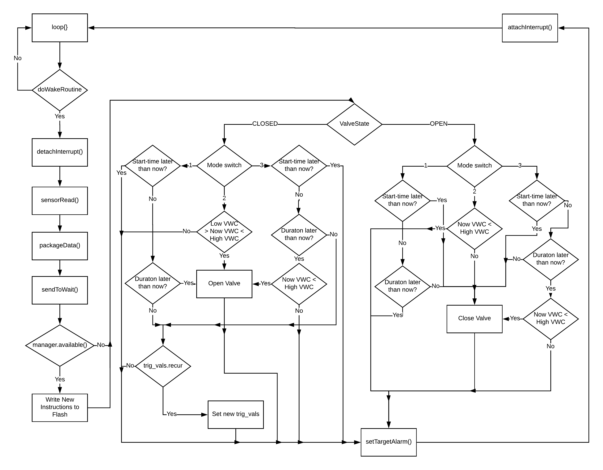

# Valve-control and Soil-quality Sensing Device.

This is the documentation for the valve-control and soil-quality sensing device.

The main .ino file in this folder is the relay_device.ino file. All other .ino files are strictly support files.

This document will be broken down by the various .ino files and explained by the included parts of each.

# Table of contents
- [.ino file explanations](#ino-files-explained)
- [relay_device](#relay_device)
- [sensor_utils](#sensor_utils)
- [osc_handling](#osc_handling)
- [rtc_utils](#rtc_utils)
- [mem_check](#mem_check)
- [batt_utils](#batt_utils)
- [valve_control_util](#valve_control_util)

# Ino files explained

### relay_device

This is the main .ino file for the valve-controller. All of the device logic and communications happen in this file. It is supported by functions contained within the other .ino files in this directory.

The general premise of this file is that the main-loop idles, waiting for an RTC event to occur. When the RTC fires, it sets the doWakeRoutine flag to true. This in turn:
1. Takes a data read.
2. Packages the data.
3. Attempts sendToWait() hub device.
4. Listens for new instructions of connection to hub occurs.
5. Does valve-controller logic.
6. Sets new alarm (if desired).
7. Returns to loop idling.

The general logic flowchart for the main loop is as follow:

[(Back to top)](#table-of-contents)

### sensor_utils

The support file for handling reads from the Decagon GS3 sensor used in this project.
The functions contained are:
* preReadClean() - Used to clear out the buffers used for reading the GS3 device.
* sensorRead() - Takes the actual read from the GS3 sensor. Builds the response by appending new characters to a character array and storing in sdiResponse.
* packageData() - Takes the gathered data from sensorRead() and adds it as messages into the Open Sound Control message bundle. Calls get_OSC_string from the osc_handling.ino file.

[(Back to top)](#table-of-contents)

### osc_handling
The support file for handling Open Sound Control (OSC) bundles and messages used for messages passing in this project.
The functions contained are:
* get_OSC_string(OSCBundle\*, char\*) - Takes the passed in OSCBundle and char\*, and pulls each message from the OSC bundle and appends it to the char\* buffer.
* get_OSC_string(char\*, OSCBundle\*) - Takes the passed in char\* and OSBundle, parses the character array into a string, and then adds the string to the OSC bundle as an OSC message.

[(Back to top)](#table-of-contents)

### rtc_utils
The support file for handling the use of the DS3231 real-time clock device.
The functions contained are:
* InitalizeRTC() - Called once during device power-up in the Setup() function at the top of relay_device.ino, this function sets up the RTC in the event of power-failure or first-time run. Sets the current date and time to the most recent code compile time.
* setTargetAlarm(byte, unsigned int) - This function takes a byte value (1 or 2) for the alarm you wish to use set. The second parameter is the offset in minutes from now for the alarm to next wake-up.
* clearTargetAlarm(int) - Clears the target alarm (1 or 2) of any current alarms.
* wake() - The wake up routine that is called when an alarm fires.

[(Back to top)](#table-of-contents)

### mem_check
A debugging support library.
The functions contained are:
* freeMemory() - This is used for ARM processors to determine how much free memory remains on the devices heap.

[(Back to top)](#table-of-contents)

### batt_utils
A support library used to read the current power-status of a connected battery.
The functions contained are:
* check_batt() - Takes a read from the connected battery and returns it as a float.

[(Back to top)](#table-of-contents)

### valve_control_util
A support library used to control an attached valve-motor. This particular support library is most useful for a two-way motor device that is control by two attached relays that are connected to different digital logic pins.
The functions contained are:
* valve_open() - digitalWrites() high on "Open" IO-pin, and low on "Close" pin. Has a variable pressure-relief timer defined at the top of the file.
* valve_close() - digitalWrites() low on "Open" IO-pin, and high on "Close" pin. Has no pressure relief timer, fully closes with no pause.
* valve_off() - A safety measure, digitalWrites() low on "Open" IO-pin, and low on "Close" pin.

[(Back to top)](#table-of-contents)
